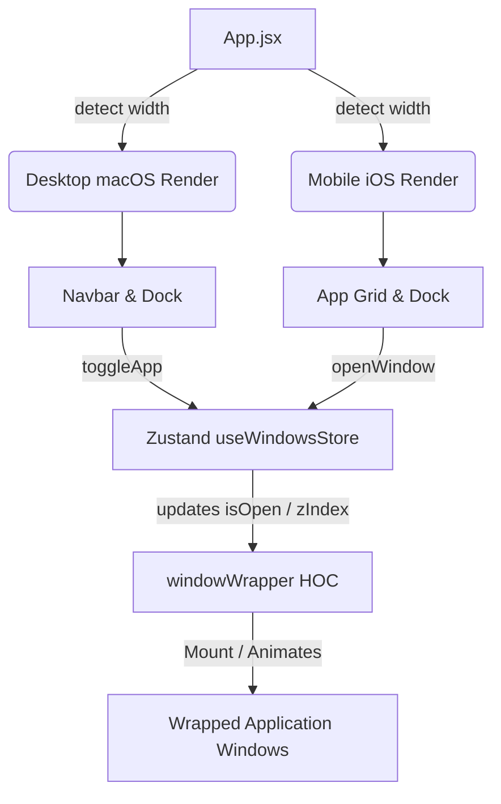

#  macOS & iOS 18 Portfolio Simulator

[](https://react.dev)
[](https://vite.dev)
[](https://tailwindcss.com)
[](https://greensock.com/gsap/)
[](https://zustand-demo.pmnd.rs/)

An immersive, premium personal portfolio website that simulates a fully interactive macOS desktop environment on desktop screens and dynamically shifts to a beautiful iOS 18/iPhone 16 emulation on mobile screens. 

---

## 🌟 Dual-OS Experience

This portfolio implements a responsive framework that detects screen sizes and loads entirely different OS simulations for the ultimate responsive experience:

### 💻 1. macOS Desktop Mode (Desktop & Tablet)
* **Draggable Windows**: Run-time window coordinate calculation and z-index ordering using GSAP's `Draggable` plugin.
* **Intelligent Dock**: Dynamic icon scaling based on mouse cursor distance using an exponential damping function ($e^{-d^2.8 / 20000}$).
* **macOS Navbar & Control Center**: Fully featured dropdown panel displaying battery percentage, brightness slider, sound level, active light/dark theme toggles, and live system datetime updates.

### 📱 2. iOS 18/iPhone 16 Mode (Mobile)
* **Status Bar**: Matches standard iOS layout with time, signal bars, Wi-Fi indicators, and dynamic low-power battery icon.
* **App Grid & Dock**: Custom app layout supporting touch-active scaling effects.
* **Control Center (iOS 18 Style)**: Accessible swipe/click trigger opening a blur-filtered connectivity cluster (Airplane mode, Wi-Fi, Bluetooth, Flashlight), Calendar preview, custom brightness/volume inputs, and utility shortcuts.
* **Full-Screen Modals**: Windows transform into native mobile applications that slide up from the bottom with natural easing curves.

---

## 📂 Pre-Installed Applications

| App | Icon | Key Features |
| :--- | :--- | :--- |
| **Finder** | `finder.png` | Sidebar-navigated file browser. Operates over nested filesystem structures. Directly triggers individual file-type components (e.g., launching text reader or Safari based on file type). |
| **Safari** | `safari.png` | Fully responsive mock web browser featuring Favorites bookmarks, a custom Privacy Report (tracker shield), and direct project previews with links to Github and live deployments. |
| **Gallery** | `photos.png` | Carousel-integrated photo library with album directories (Library, Memories, Places, People, Favorites). |
| **Skills Terminal** | `terminal.png` | Interactive terminal simulation showing development skills organized by category, mimicking compilation checks. |
| **Resume PDF** | `file.svg` | Embedded PDF reader leveraging `react-pdf` for annotation and text-layer rendering, with direct download hooks. |
| **Contact** | `contact.png` | Quick connection cards. Supports single-tap clipboard copy for email/phone with real-time feedback animations. |

---

## 🛠️ Architecture & State Flow



### 1. Higher-Order Component (`windowWrapper.jsx`)
All window modules in `src/windows/` are wrapped with a `windowWrapper` HOC that abstracts:
* **Draggability**: Attaches a custom GSAP Draggable instance dynamically on desktop layout.
* **Opening/Closing Animations**: Leverages GSAP `fromTo` transitions (`scale`, `opacity`, `translateY`) to mimic physical window opening.
* **Mobile Adaptability**: Intercepts width adjustments and switches from absolute-positioned desktop shapes to fixed full-screen bottom-sheet sliders.

### 2. State Management (`Zustand + Immer`)
State is segmented into two reactive stores:
* **Window Store (`window.js`)**: Tracks which apps are open, their respective focus indexes (`zIndex`), and any injected local context data.
* **Location Store (`location.js`)**: Tracks folder navigation inside the Finder app so that clicking nested directories preserves navigation state globally.

---

## ⚡ Technical Stack

* **Core UI**: React 19, JavaScript (ES6 Modules)
* **Build System**: Vite 7 & Tailwind CSS v4
* **Animations**: GSAP (GreenSock Animation Platform) & `@gsap/react`
* **State Management**: Zustand v5 (utilizing Immer middleware for nested updates)
* **Date Parsing**: Day.js
* **PDF Engine**: PDF.js (configured with Webpack/Vite workers via `react-pdf`)
* **Styling Utilities**: `clsx`, modern glassmorphism backdrops (`backdrop-blur`)

---

## 🚀 Getting Started

Ensure you have **Node.js** or **Bun** installed.

### Installation
```bash
# Clone the repository
git clone https://github.com/kuldeeprajput-dev/MacOs-portfolio.git

# Navigate to the workspace
cd MacOs-portfolio

# Install dependencies using Bun
bun install
# or npm
npm install
```

### Running Locally
```bash
# Start the local development server
bun dev
# or npm
npm run dev
```

Open `http://localhost:5173` in your browser.

### Build and Preview
```bash
# Build for production
bun run build

# Preview the build locally
bun run preview
```

---

## 📂 Repository Structure

```
MacOs-portfolio/
├── src/
│   ├── components/         # Global Layout elements (Dock, Navbar, MobileOS, Control Centers)
│   ├── constants/          # Application data definition (navLinks, projects, techStack, folder systems)
│   ├── hoc/                # Higher-Order Components (windowWrapper)
│   ├── store/              # Zustand global state (window, location)
│   ├── windows/            # Application window components (Finder, Safari, Terminal, Resume, Photos)
│   ├── index.css           # Core styling tokens & animations
│   ├── App.jsx             # Device-detection shell and entry mounting
│   └── main.jsx            # Entry point
├── public/                 # Static images, icons, and asset binaries
├── vite.config.js          # Vite optimization & plugin config
└── package.json            # Dependencies & scripts
```

---

## 🛠️ Developer Guide: How to Add a New App

Adding a new application to the desktop simulator is simple. Follow these steps:

### Step 1: Create your Window Component
Create a new file in `src/windows/YourApp.jsx`:
```jsx
import WindowControls from "#components/WindowControls";
import windowWrapper from "#hoc/windowWrapper";

const YourApp = () => {
  return (
    <>
      <div id="window-header">
        <WindowControls target="yourapp" />
        <h2>Your Application</h2>
      </div>
      <div className="p-4 bg-white text-black h-full">
        {/* Your application core goes here */}
        <p>Welcome to your new macOS application!</p>
      </div>
    </>
  );
};

// Wrap with windowWrapper, passing your component and key
const YourAppWindow = windowWrapper(YourApp, "yourapp");
export default YourAppWindow;
```

### Step 2: Register in Configs
Open `src/constants/index.js` and make the following additions:

1. Add your application details inside `dockApps`:
```javascript
{
  id: "yourapp",
  name: "My App",
  icon: "yourapp-icon.png", // Place icon image in /public/images/
  canOpen: true,
}
```

2. Register the default window configurations inside `WINDOW_CONFIG` at the bottom of `index.js`:
```javascript
export const WINDOW_CONFIG = {
  // ...other apps
  yourapp: { isOpen: false, zIndex: INITIAL_Z_INDEX, data: null },
};
```

### Step 3: Mount the App Window in `App.jsx`
Open `src/App.jsx`, import your wrapped window, and add it inside both the mobile and desktop render zones:
```jsx
import YourApp from "#windows/YourApp";

// Inside App component:
if (isMobile) {
  return (
    <main className="mobile-os">
      {/* ...other apps */}
      <YourApp />
    </main>
  );
}

return (
  <main>
    {/* ...other apps */}
    <YourApp />
  </main>
);
```
Your new app is now integrated and will handle scaling, draggability, active focus, and mobile responsiveness automatically!